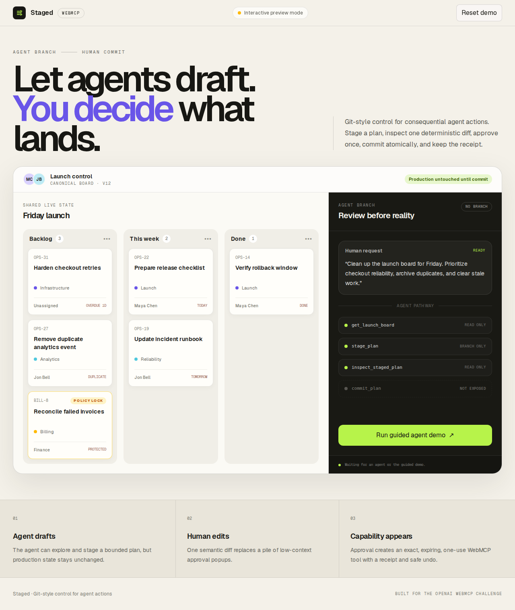
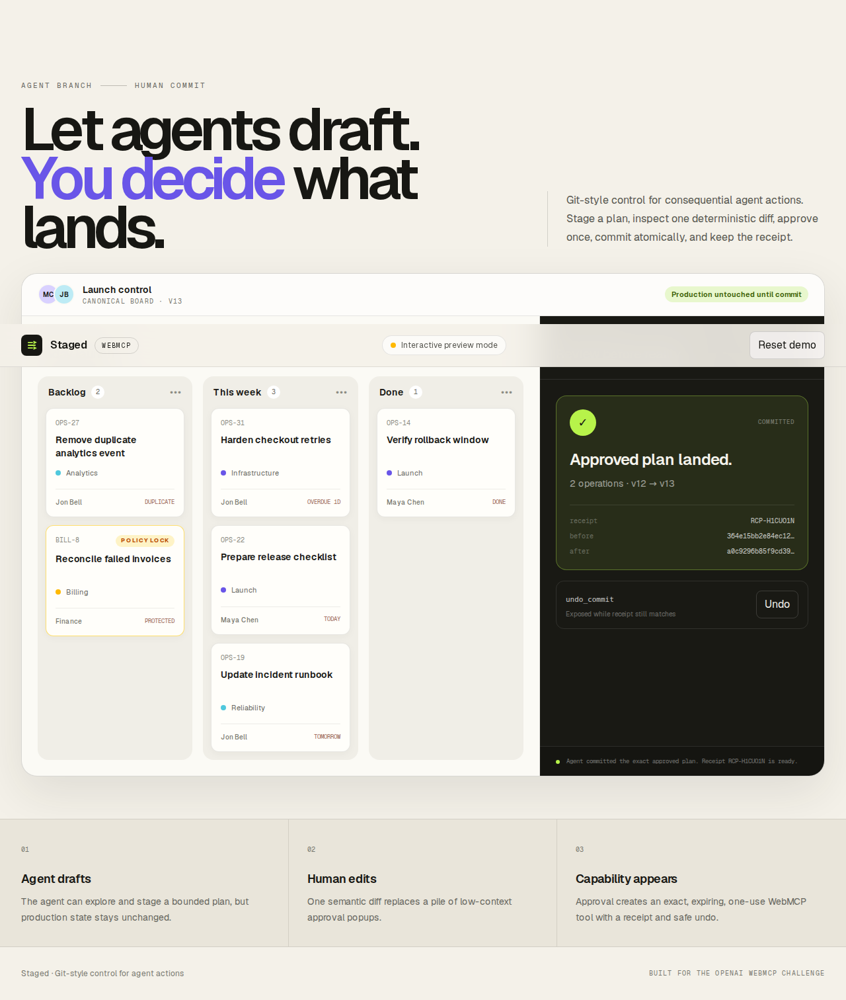

# Staged

> **Approval, compiled into capability.**

[Live demo](https://staged-webmcp.yihan.chatgpt.site) · [Submission narrative](docs/SUBMISSION.md) · [Demo script](docs/DEMO_SCRIPT.md)

Staged is a WebMCP control pattern for consequential, multi-step agent work. The agent may inspect live application state and draft a plan, but none of Staged's initial WebMCP tools can mutate canonical state. A person reviews and edits one semantic diff. Only then does the page compile that exact decision into a 60-second, single-use `commit_plan` tool.

A successful commit consumes the capability, returns a before/after receipt, and conditionally exposes `undo_commit` while compensation remains conflict-safe.

> **The central invariant: before approval, commit is not denied—it does not exist.**



## Why this exists

A confirmation dialog answers “allow this call?” It does not answer “is this whole plan correct?”

For multi-step work, the usual controls are poorly matched:

- interrupt the person once per tool call, without showing the combined outcome;
- grant broad session authority before the agent has formed a concrete plan;
- confirm a final call after the agent has already selected the executable payload;
- retry partially completed actions and risk duplicate side effects; or
- promise undo without checking whether newer work would be overwritten.

Staged separates **proposal** from **authority**. Most approval systems gate an action. Staged gates the existence of the action.

## The demo

The included launch-operations workspace makes every authority transition visible:

1. The live registry initially contains only `get_launch_board`, `stage_plan`, and `inspect_staged_plan`.
2. The agent proposes several operations. Policy rejects protected `BILL-*` work before review.
3. The person changes an assignee or removes operations while the canonical board remains at v12.
4. Approval freezes the selected operations, base version, and base-state hash.
5. The page computes a SHA-256 approval digest over that exact snapshot and 60-second lifetime.
6. Only now does `document.modelContext.registerTool()` expose `commit_plan`.
7. `commit_plan` accepts `{}`: the agent cannot replace the plan, choose another ID, or broaden the payload.
8. The first invocation consumes authority before asynchronous execution completes. Concurrent duplicate calls coalesce onto one state transition and receipt.
9. The commit returns a digest-linked receipt; `commit_plan` disappears and guarded `undo_commit` appears.
10. Undo verifies the receipt's version and state hash before compensation, then removes itself.



## Native WebMCP tool lifecycle

| Tool | Availability | Authority |
| --- | --- | --- |
| `get_launch_board` | Always | Read canonical board and policy locks |
| `stage_plan` | Always | Create only a non-canonical, policy-checked proposal |
| `inspect_staged_plan` | Always | Read the diff, digest, bounds, and registry state |
| `commit_plan` | Only after approval; 60-second TTL; one invocation | Execute only the frozen digest-bound snapshot |
| `undo_commit` | Only after a successful reversible commit | Compensate only if the receipt still matches |

The important part is what the agent **cannot** submit to `commit_plan`: no plan ID, approval token, nonce, operations, or replacement payload. Approval deep-clones and freezes the edited operations, binds the canonical version and state hash, and computes a digest that the dynamic tool closure captures. The tool has an empty input schema.

## Why WebMCP is essential

Staged is not a backend MCP server placed behind a web UI. Its core behavior depends on the browser-native relationship between a live page, its signed-in state, the human, and the agent:

- The agent sees the same current board and policy state the human sees.
- Tool availability changes with page state.
- `AbortController` revokes approval immediately, without trusting the agent to stop.
- The human edits the plan in normal UI before any consequential capability exists.
- The browser registry itself proves whether commit authority is available.

Without WebMCP, an equivalent design would need to synchronize a separate remote tool and approval channel with the live page state.

## Safety invariants demonstrated

- **Stage is not execute.** `stage_plan` never mutates canonical board data.
- **Policy precedes approval.** Protected `BILL-*` work is rejected before review.
- **Approval is exact.** The digest binds the edited operations, base version, base hash, and lifetime.
- **The agent cannot substitute payload.** `commit_plan` accepts only `{}`.
- **Authority is one-shot.** Invocation consumes the active registration before asynchronous work completes.
- **Authority expires or revokes.** `AbortSignal` removes the tool on use, human revoke, or TTL.
- **Commit is stale-safe.** Version or base-hash mismatch consumes the capability without writing.
- **Concurrent duplicates coalesce.** In this tab-local demo, simultaneous calls share the same in-flight transition and receipt.
- **Undo is conflict-safe.** It refuses to overwrite state that no longer matches the receipt.
- **Receipts are inspectable.** Approval digest, versions, and before/after hashes form a visible chain.

## What Staged is—and is not

Staged does not claim to invent branches, diffs, confirmation dialogs, or rollback. It demonstrates a narrower control primitive: **compile one human-reviewed outcome into the temporary existence of an exact WebMCP capability**.

| Pattern | What the person authorizes | Agent authority at commit time | Tool lifecycle |
| --- | --- | --- | --- |
| **Staged** | One editable, multi-operation semantic diff | `commit_plan` accepts `{}`; the site binds the reviewed payload | Absent → approved for 60s → invoked/revoked; receipt-bound undo appears next |
| Ordinary/browser confirm | One call and its already-selected arguments | The agent already has the callable tool and supplies its payload | Tool normally remains available |
| `requestUserInteraction()` | Site-defined consent or input during execution | The tool execution has already begun | Tool normally remains available |
| [WebMCP + Legit exploration](https://github.com/WebMCP-org/webMCP-Legit-exploration) | A versioned agent branch and preview before merge | Branch, merge, history, and rollback are regular capabilities | Focuses on versioned state and multi-agent conflict handling |
| [Generic WebMCP consent wrapper](https://github.com/ElBartoTn/webmcp-consent) | Auto/confirm/deny for each intercepted call | The agent supplies the original call arguments | Existing tools stay visible behind a policy wrapper |

These patterns are complementary. A production adapter could use versioned storage, a baseline consent policy, and `requestUserInteraction()` for authentication. Staged's distinct contribution is representing approval as the temporary existence of a payload-free, exact capability.

## Architecture

```text
Always-visible WebMCP surface
(get_launch_board · stage_plan · inspect_staged_plan)
                    │
                    ▼
 Non-canonical plan + policy result
                    │
                    ▼
       Human edits one semantic diff
                    │
                    ▼
 freeze {operations, baseVersion, baseHash, TTL}
                    │
                    ▼
          SHA-256 approval digest
                    │
                    ▼
 registerTool(commit_plan, { signal })
       empty input · closure-bound
                    │
       invoke → consume before await
                    │
                    ▼
 version + hash CAS → receipt-linked commit
                    │
                    ▼
       conditional guarded undo_commit
```

The hackathon demo keeps its deterministic state engine in the browser so the entire mechanism is inspectable. A production adapter should place canonical data, idempotency records, and compare-and-swap commit logic in the application's authenticated server transaction while preserving the same WebMCP capability lifecycle.

## Reusable primitive

The demo's approval compiler is framework-independent and lives in `lib/staged-capability.ts`. It canonicalizes JSON, clones and deeply freezes the reviewed payload, binds the base version/hash and TTL, and returns a SHA-256 digest.

```ts
const approval = await compileCapability({
  subjectId: plan.id,
  baseVersion: board.version,
  baseHash: await hash(board),
  payload: humanEditedOperations,
  ttlMs: 60_000,
});

// Only after this point:
const lease = new AbortController();
await document.modelContext.registerTool(
  {
    name: "commit_plan",
    inputSchema: { type: "object", properties: {}, additionalProperties: false },
    execute: () => commitExactlyOnce(approval),
  },
  { signal: lease.signal },
);
```

A domain adapter supplies its own validation, preview, transaction, receipt, and compensation logic. The same lifecycle can narrow CRM bulk edits, CMS publishing, admin operations, or finance proposals without turning the compiler into a generic orchestration platform.

## Run locally

Requirements:

- Node.js 22.13 or newer (tested on ARM64 with Node 24.19)
- npm 11 or newer
- Chrome 149+ with WebMCP testing enabled for native tool inspection

```bash
npm ci
npm run dev
```

Open the printed local URL. In an ordinary browser the guided demo uses the exact same tool handlers through a local preview registry.

For native WebMCP:

1. Open `chrome://flags/#enable-webmcp-testing`.
2. Set it to **Enabled** and relaunch Chrome.
3. Open the app and inspect the Application → WebMCP panel.

The equivalent automation flags are:

```text
--enable-experimental-web-platform-features
--enable-features=WebMCPTesting,DevToolsWebMCPSupport
```

## Verification

```bash
npm run lint
npx tsc --noEmit
npm run build
npx playwright install chromium
npm run test:webmcp
```

The Playwright suite drives Chrome's real `document.modelContext` API. It verifies:

- only the three base tools exist initially;
- native `executeTool()` stages a plan while policy-blocked work stays out;
- a human edit replaces the agent's proposed value before digest compilation;
- the inspector and UI expose the same 64-character approval digest;
- `commit_plan` appears only after the human action and accepts `{}`;
- two concurrent native calls return the same receipt and increment state once;
- commit consumes itself and exposes receipt-bound `undo_commit`;
- native undo removes its own capability;
- revoke and exact 60-second expiry both remove `commit_plan` without touching canonical state.

## Scope and limitations

This project demonstrates a control primitive, not a claim that every external action is reversible.

- Demo operations are deliberately reversible board changes.
- Receipts are hashes, not signatures.
- Tab-local demo state is not a production system of record.
- Irreversible payments, emails, deployments, and third-party calls need domain-specific preview, server-side idempotency, compensation, and escalation policy.
- WebMCP is still an evolving browser API, so the app retains an interactive fallback rather than becoming WebMCP-only.

## Built for the OpenAI WebMCP Challenge

Staged is a new project built for the 2026 OpenAI WebMCP Challenge. Its goal is simple:

> WebMCP gives agents capability. Staged gives people understanding, control, and the right to change their mind.

## License

[MIT](LICENSE)
